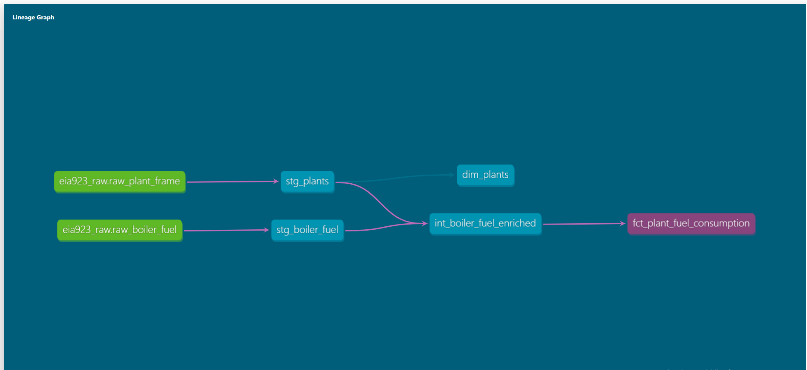

# U.S. Electric Power Fuel Consumption Pipeline (EIA-923)

An end-to-end ELT data pipeline built with **DuckDB** and **dbt** to clean, transform, and model raw U.S. Energy Information Administration (EIA) Form 923 data into an analytical star schema.

---

## Business Problem & Objectives

The EIA publishes annual operational figures covering every utility-scale power plant in the United States. While comprehensive, the raw files present common operational hurdles:
* Entity metadata (plant locations, grid operators, CHP status) lives on separate schedules (Page 6) from boiler-level fuel burn records (Page 3).
* Raw files contain multi-line headers, spaces, inconsistent capitalization, embedded commas in numbers, and empty strings stored where numeric values belong.
* Multiple reports per plant across time require careful deduplication to prevent inflated numbers.

This pipeline automates the ingestion, sanitization, and transformation of that data to answer core business questions:
* Which generation facilities burn the highest physical volume of fuel nationwide?
* How is thermal fuel demand distributed across balancing authorities and states?
* How many active boilers does each plant maintain to support its generation volume?

---

## Data Architecture

The project implements a four-layer modular ELT architecture:

* **Raw / Source Layer:** Ingested raw Excel/CSV data directly into DuckDB using `normalize_names=True` to enforce standard `snake_case` column headers automatically.
* **Staging Layer (`stg_`):** Materialized as views. Dedicated 1:1 to source tables to handle type conversions, clean whitespace, convert empty strings to nulls via `try_cast`, and deduplicate plant records using window functions (`row_number() over (partition by plant_id)`).
* **Intermediate Layer (`int_`):** Materialized as views. Encapsulates business logic and entity joins between boiler-level fuel data and plant frame metadata, keeping downstream queries clean and DRY.
* **Marts Layer (`dim_` / `fct_`):** Materialized as physical tables implementing a Kimball-style star schema:
  * `dim_plants`: Dimension table storing plant identity, state, and balancing authority attributes.
  * `fct_plant_fuel_consumption`: Fact table aggregating annual fuel consumption and boiler counts by plant and fuel type.

---

## Data Lineage

---

## Testing & Quality Control

Data integrity is enforced with automated dbt tests defined in `schema.yml`:
* **Primary Key Constraints:** `unique` and `not_null` validation on `dim_plants.plant_id`.
* **Referential Integrity:** `relationships` test guaranteeing that every foreign key in `fct_plant_fuel_consumption.plant_id` maps to an existing record in `dim_plants`.
* **Metric Validation:** `not_null` checks on fuel quantities and fuel type codes to ensure complete aggregation outputs.

---

## Key Insights

Querying the mart directly produces actionable operational metrics:

* High-volume natural gas consumption is heavily concentrated in large southern combined-cycle facilities (Florida, Georgia, Texas), with individual plants burning 80M to 130M+ Mcf annually across 3 to 4 core boilers.
* Heavy industrial sites (such as Gary Works in Indiana) dominate alternative fuel metrics, burning massive volumes of industrial byproducts like blast furnace gas (`BFG`).

---

## How to Run Locally

### Prerequisites
* Python 3.10+
* DuckDB CLI

### Setup & Execution

1. Clone the repository:
   git clone <your-repo-link>
   cd eia923_project

2. Create and activate a virtual environment:
   python3 -m venv venv
   source venv/bin/activate
   pip install dbt-duckdb duckdb

3. Run transformations and tests:
   cd eia923_pipeline
   dbt run
   dbt test

4. View docs and lineage graph:
   dbt docs generate
   dbt docs serve --port 8080
